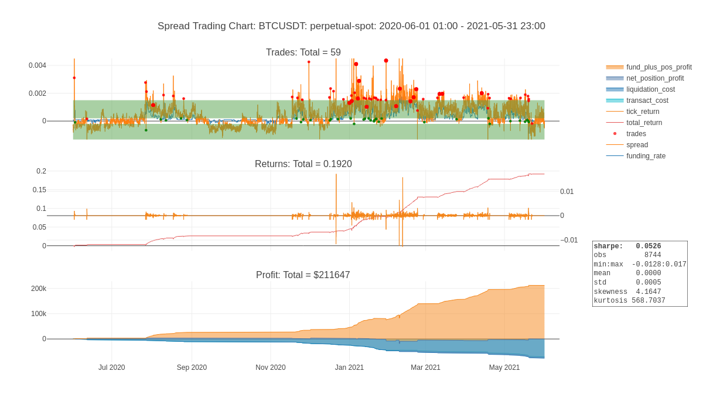
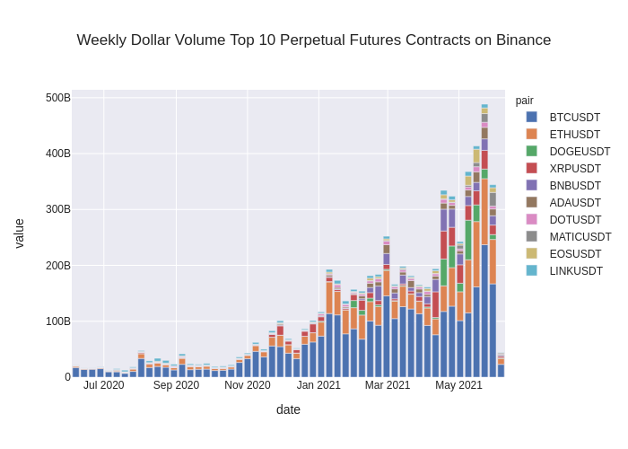

# FINM33150 - Final Project

## Dependencies

Create a virtual environment and install dependencies with

    pipenv install

## Run or View Notebook

See `final_project.ipynb` or [html version](https://calebeverett.github.io/finm33150-final-project/) for full discussion and analysis.

## Summary

This is a quantitative trading strategy involving perpetual futures contracts on crypto tokens. Perpetual futures contracts are instruments that trade on the major crypto token exchanges that are similar to traditional futures contracts, but have no expiration date. In order to keep the futures contract price in line with the spot price a funding rate is employed. Long holders of the perpetual futures contracts pay the funding rate to the short holders of the perpetual futures contracts. The funding rate is determined by formula based on the spread between the perpetual futures contract price and the spot price, increasing as the spread increases and contracting as the spread narrows, and flipping such that the short holders pay the long holders if the spread becomes sufficiently negative.

This strategy is designed to capture the funding rate while limiting risk related to movements in the prices of the crypto tokens themselves to de minimis levels. It is effected by establishing a short position in the perpetual futures contract when the funding rate is attractive in order to capture the funding rate payments while establishing a corresponding short position of equivalent size in the underlying crypto token in order to hedge against price fluctuations.

## Assets
Our initial execution of this strategy includes ten crypto tokens on the exchange with the largest trading volume of perpetual futures contracts.

## Literature
As these are relatively new asset classes, there isn't yet a significant body of academic literature covering them. There were however, three papers of note. The first is by Robert Shiller (of real estate fame) in 1993 and is the first known mention of the perpetual futures contruct, [Measuring Asset Values for Cash Settlement in Derivative Markets: Hedonic Repeated Measures Indices and Perpetual Futures](https://ideas.repec.org/a/bla/jfinan/v48y1993i3p911-31.html). The second is more recent by Carol Alexender, et al., in 2020 in the Journal of Futures Markets, BitMEX Bitcoin [Derivatives: Price Discovery, Informational Efficiency and Hedging Effectiveness](https://papers.ssrn.com/sol3/papers.cfm?abstract_id=3353583). Their main contribution is to show that the crypto perpetual futures can be used as effective hedging instruments against exposure to spot crypto token positions. The last one is also by Carol Alexander, et al., [Optimal Hedging with Margin Constraints and Default Aversion and its Application to Bitcoin Perpetual Futures](https://arxiv.org/pdf/2101.01261.pdf), in 2021. The main contribution of this paper is to consider leverage and liquidation penalties in determining optimal hedging strategies. While we did not utilize classical analytical techniques to determine the relative sizes of our futures and spot positions, we did refer their analysis in the modeling leverage and liquidation penalties.

## Returns
Our base case return is 0.46 on an annualized basis with a Sharpe ratio of 1.46.

## Sizing
Our base case returns are based on a fixed position size for each token of $1.0 million. The average daily volume of perptual futures contract over the course of this year, is over $100 billion, according to [CoinMarketCap](https://coinmarketcap.com/derivatives/). We have left as a future enhancement the determination of optimal sizing and portfolio composition across exchanges and tokens, but believe based on the size of the overall markets that positions of significance are available.

## Risks
Below are the primary risks we have identified:

1. Overall crypto regulatory risk
1. Risk of exchanges being hacked and/or prices being manipulated
1. Specific exchange risk related to derivates regulation
1. Perpetual futures contracts are a relatively new asset class, having just begun trading in 2016
1. Operations must be established outside the United States. None of the crypto exchanges are registered in the United States
1. Extreme volatility of underlying crypto tokens may result in unhedged positions

## Future Enhancements
This is a preliminary opportunity analyis, that we believe establishes the merit of continuing to investigate this strategy and enhance it's potential risk-return profile. Below is a list of areas for further investigation:

1. Further diversify by trading on other exchanges
1. Optimize allocation of capital and position sizing among exchanges and tokens based on volume and proper portfolio analytics
1. Consider further spread-hedging opitimization based on classical hedging techniques and those presented in the literature referred to above by Alexander, et al.
1. Further optimize entry, hold and exit rules based on empirical analyses of the duration and magnitude of spreads and funding rates
