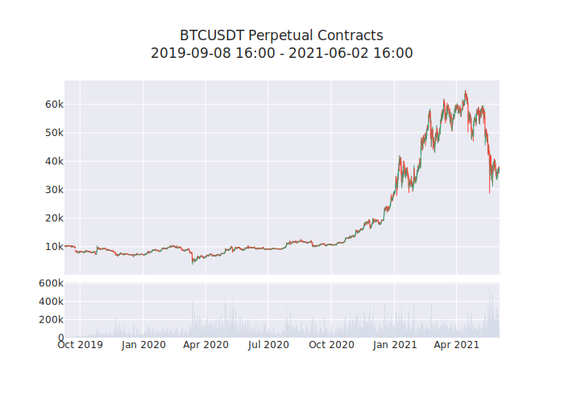

******
Plotly
******

Perpetual Overview
==================

This is the next chart

    Perpetual contract price every 8 hours.

.. csv-table:: Benchmark Return
    :name: fu
    :file: _static/bench.csv
    :header-rows: 2
    :stub-columns: 1

.. plotly:: plot_func.py show_funding_rate
    :iframe-height: 800px
